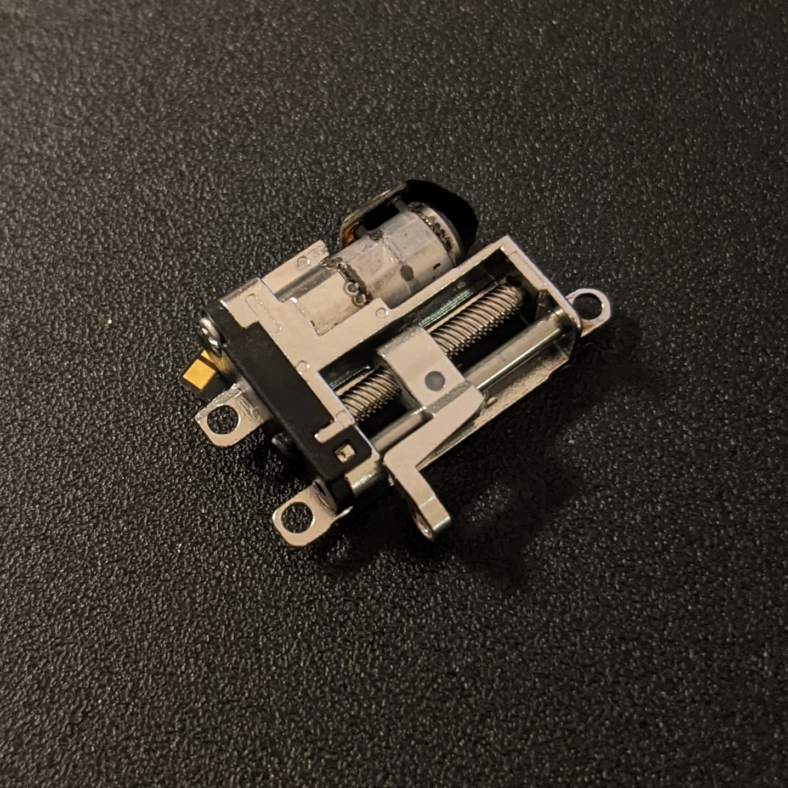
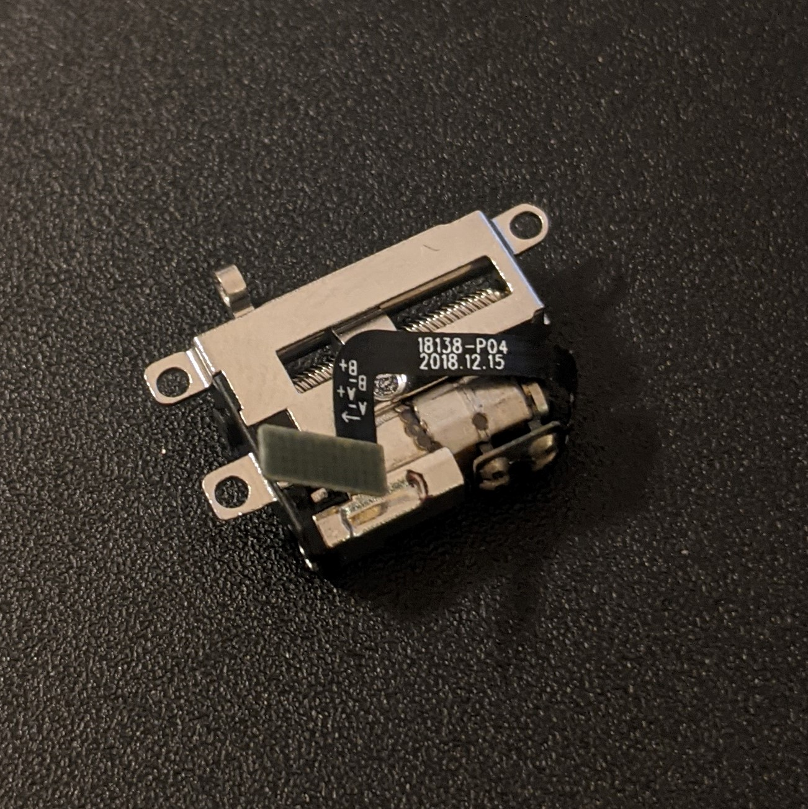
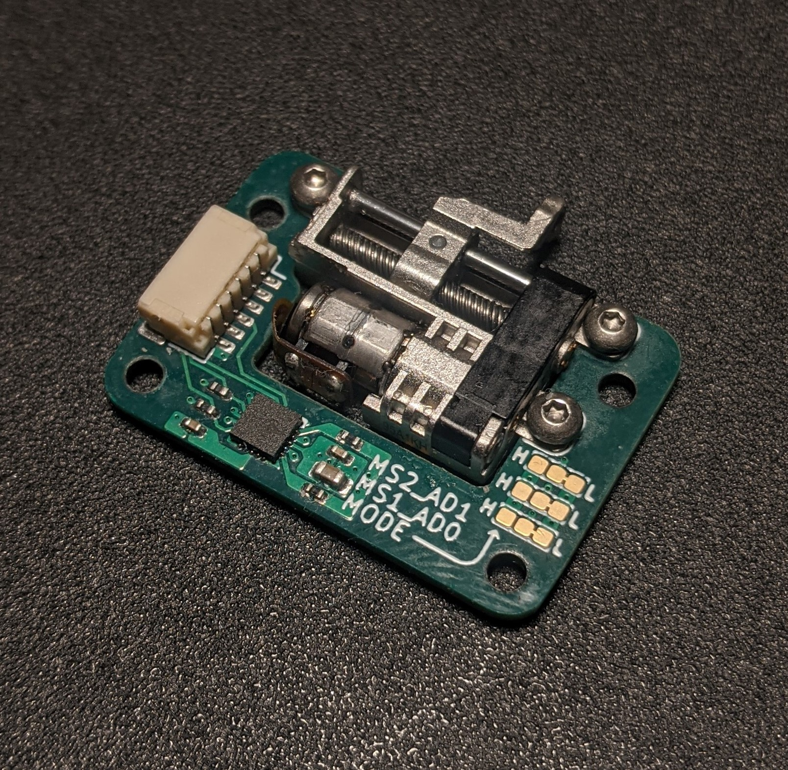
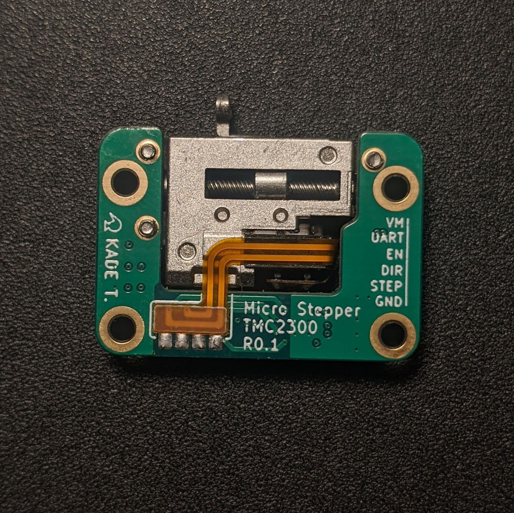
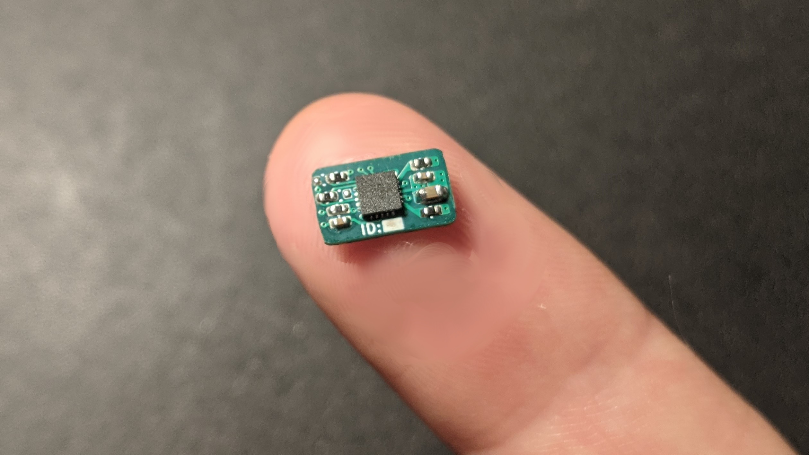
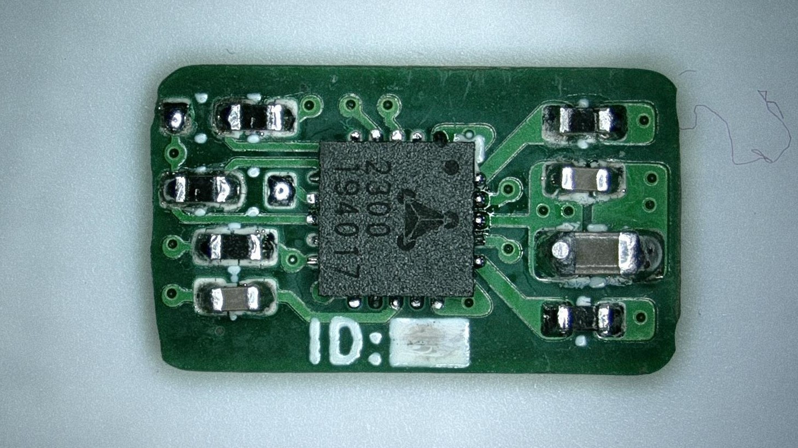
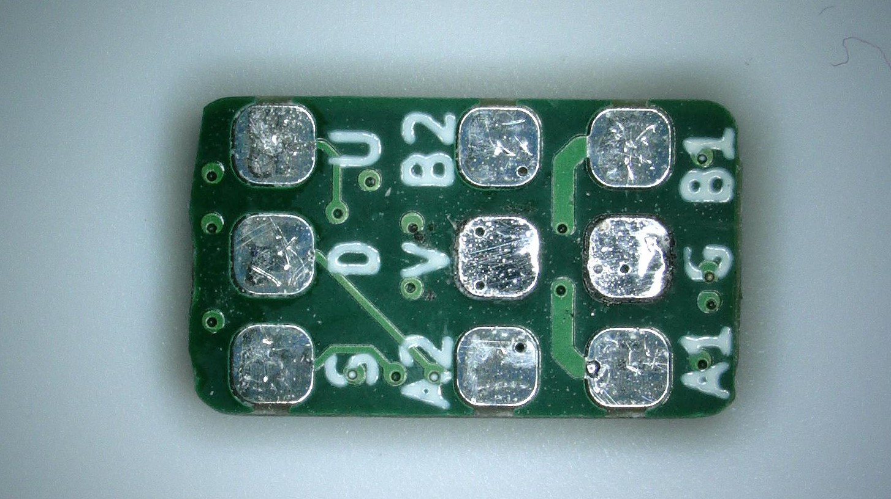

# Micro Stepper

This repository contains work on various breakout boards for the micro linear stepper motors used in motorised mobile phone cameras.

These stepper motors are available in several variations from different Chinese suppliers.

Current and future CAD models for the stepper motors can be found [here](hw/cad).

All PCBs are created using KiCad Nightly builds.

---

## Micro Breakout

The first breakout board is based on [this](https://www.aliexpress.com/item/4000616045699.html?spm=a2g0s.12269583.0.0.51854815RwJf8O) stepper motor from Aliexpress.

Both the Model A and Model B variants work with this breakout (the only difference being their linear guide mounting features).
These motors can produce a force in the range of ~100-150gf, the main downside is that they have quite a bit of backlash.

  
  

The breakout uses the [Trinamic TMC2300](https://www.trinamic.com/products/integrated-circuits/details/tmc2300-la/) low voltage stepper motor driver. 

Both step/direction and UART based control are possible, with the latter enabling current sensing (useful for end stop detection).

The UART is single wire based, so an additional external resistor is required to split TX & RX out separately (more to come on that later).

  
  

KiCad and Gerber files are located [here](hw/micro_breakout_001).

---

## Micro Driver

The World's smallest stepper driver board (probably).

Based on the same TMC2300 stepper motor driver as used in the Micro Breakout. It's designed for use with any small low voltage stepper motor.

**The PCB is just 10.2mm x 6mm!!**

    

    
    

Due to a small issue with the enable pin always pulled low, and incorrect silkscreen, the files are currently not released (wait for rev002).
