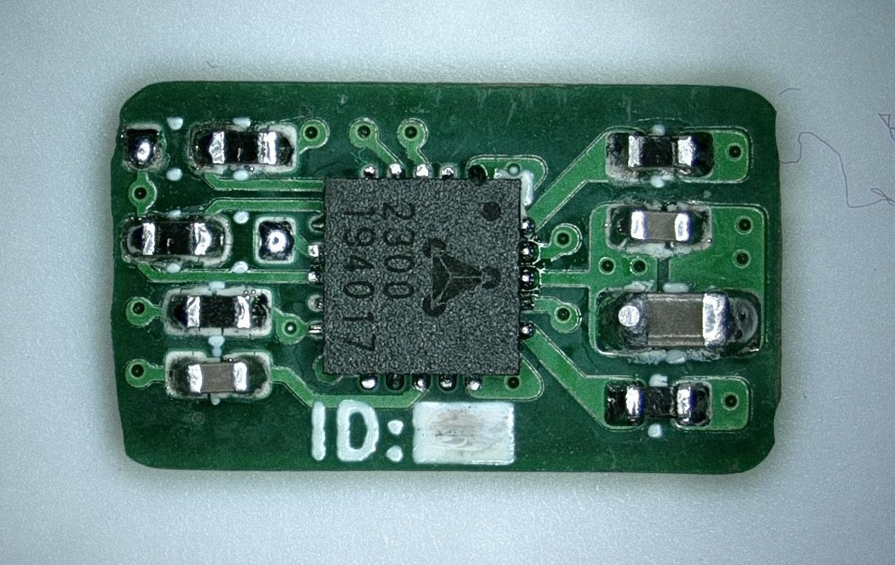
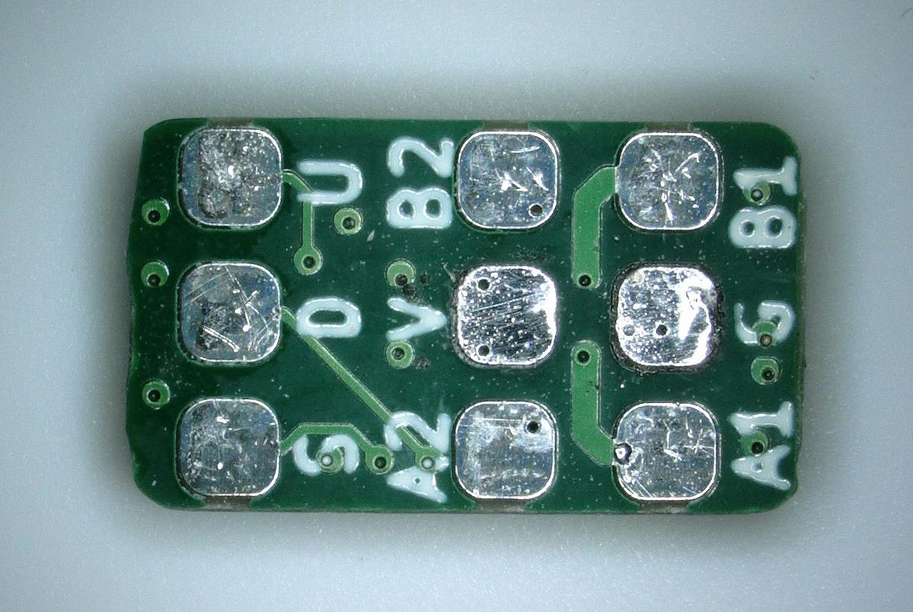

# Micro Stepper

This repository contains work on various breakout boards for the micro linear stepper motors used in motorised mobile phone cameras.

These stepper motors are available in several variations from different Chinese suppliers.

---

## Micro Breakout

The first breakout board is based on the [this](https://www.aliexpress.com/item/4000616045699.html?spm=a2g0s.12269583.0.0.51854815RwJf8O) stepper motor from Aliexpress.

Both the Model A and Model B variants work with this breakout (only difference being their linear guide mounting features).

Current and future CAD models for the stepper motors can be found [here](hw/cad). 

The breakout uses the [Trinamic TMC2300](https://www.trinamic.com/products/integrated-circuits/details/tmc2300-la/) low voltage stepper motor driver. 

Both step/direction and UART based control are possible, with the latter enabling current sensing (useful for end stop detection).

The UART is single wire based, so an additional resistor is required to split TX & RX out separately (more to come on that later).

## Micro Driver

The World's smallest stepper motor driver board (probably).

This is based on the same TMC2300 stepper motor driver used in the Micro Breakout and is designed for use with any small low voltage stepper motor.

**The PCB is just 10.2mm x 6mm!!**

Due to a small issue with the enable pin being always pulled low, the files are currently not released (wait for rev002).